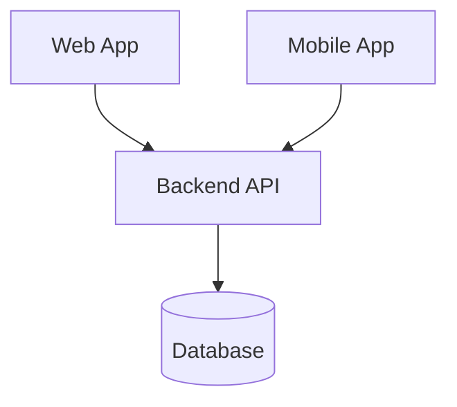
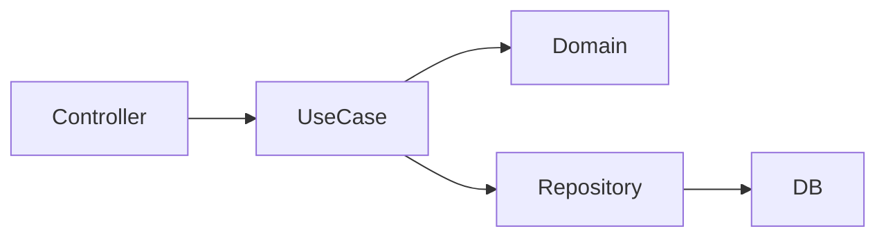
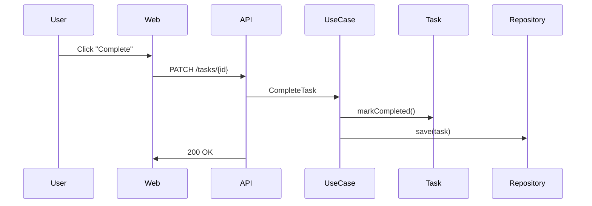

# Designing the project and architecture

1. Clarify the problem → shape the domain → define responsibilities → only then pick technology

2. Domain: The subject of the project. WWhat concepts will still exist if the UI, framework, or platform changes?
    e.g.:
    - User
    - Task
    - List
    - Daily List
    - Focus Session (future)
    - Pomodoro Cycle (future)

3. For each concept of the domain, define rules
    Example:
    - A task belongs to exactly one list
    - A daily list is derived from tasks, not manually created
    - A task can be completed only once per day
    - A focus session may or may not be linked to a task

4. Draw Responsabilities:
    - Domain: Enforces Rules
    - Application: Coordinate actions
    - UI: Input and Output
    - Infra: Persists data, and deals with externals

5. Define Structure
    - Define shape of the system
    - Expect how the system will change, and try to contain that
    - Define axes of change. E.g.:
        - UI (Web vs Mobile)
        - Features (Tasks vs Pomodoro vs Analytics)
        - Persistence (DB?)
        - Auth
        - Scale (single vs distributed)
    - Favor simplest structures, but allow extension
    - Helpful questions:
        - Multiple clients? Yes, then API boundary (Backend separate from UI). If no, monolith would be fine
        - Growing feature set? Yes, then use modular codebase. If no, flat structure is fine
        - Large number of users or throughput? Yes, use microservices. If no, monolith is fine
        - Multiple teams? Yes, define boundaries. If no, avoid distributed systems
    - In this case (for now): One deployable unit with internal modules. E.g.: Task module, List module, Focus Module
    - Draw diagram to explain. If it's not possible to explain, might be overly complex.

6. Validation
    - Consider how the project will change, and if that will work.
    - What new concepts will be created? What existing ones will change? What modules will change? Will it extend or change?

# System Architecture

## Goals
- Support Web and Mobile clients
- Allow future productivity features
- Avoid early over-engineering

## High-Level Architecture
[diagram here]

## Backend Architecture
- Modular monolith
- Domain-driven structure

## Frontend Architecture
- Shared core logic
- Separate UI layers

## Data Model (Initial)
- User
- List
- Task

## Extension Strategy
How new features (Pomodoro, Focus) are added

## Flowchart

## SEQUENCE
