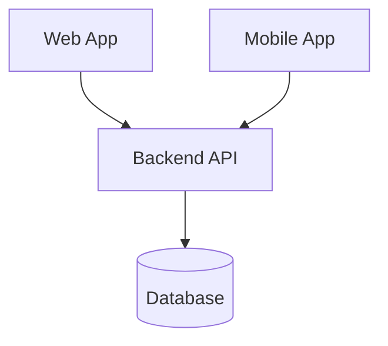
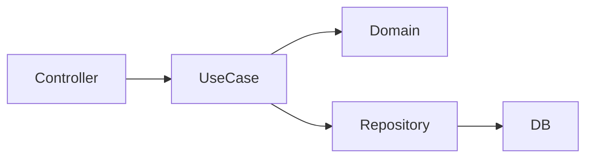
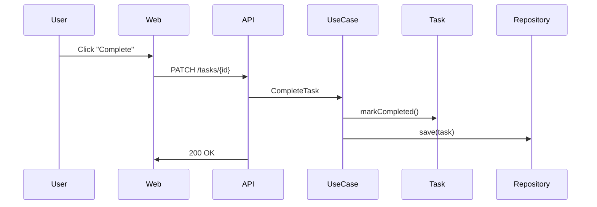

# System Architecture

## Goals
- Support Web and Mobile clients
- Allow future productivity features
- Avoid early over-engineering

## High-Level Architecture
[diagram here]

## Backend Architecture
- Modular monolith
- Domain-driven structure

## Frontend Architecture
- Shared core logic
- Separate UI layers

## Data Model (Initial)
- User
- List
- Task

## Extension Strategy
How new features (Pomodoro, Focus) are added

## Flowchart

## SEQUENCE
