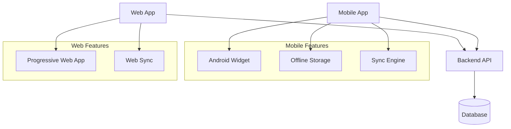
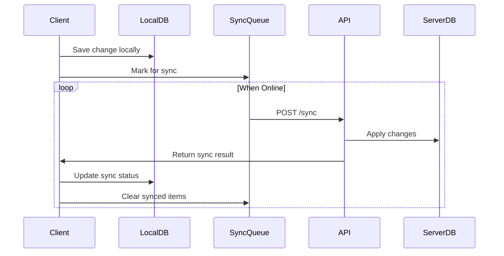
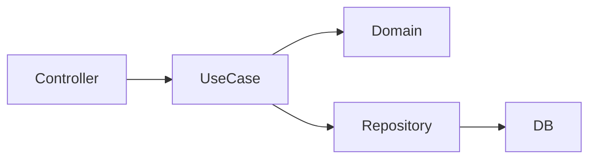
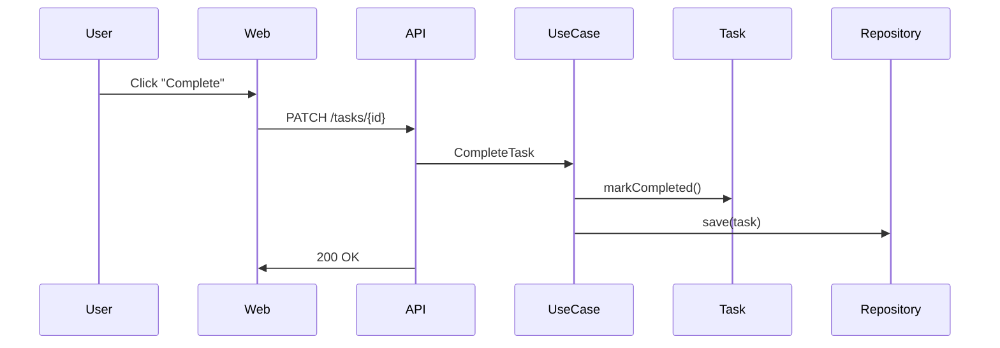

# System Architecture

## Goals
- Support Web and Mobile clients with offline-first sync
- Allow future productivity features (Pomodoro, white noise, analytics)
- Avoid early over-engineering while supporting local LAN deployment
- Provide easy-to-use UX on both platforms with configurable display options

## High-Level Architecture

## Deployment Architecture
- **Local Server**: Runs on home network, accessible over LAN
- **Offline-First**: Clients store changes locally when server unavailable
- **Conflict Resolution**: Sync engine handles async changes from multiple clients
- **Auto-Discovery**: Clients automatically discover server on LAN

## Backend Architecture

### Modular Monolith with Domain-Driven Structure
- **Rust-based** for performance and reliability
- **RESTful API** with WebSocket support for real-time updates
- **SQLite/PostgreSQL** database with migration support
- **Authentication**: JWT-based with local user accounts

### Backend Modules:
1. **User Management** - Registration, authentication, profiles
2. **List Management** - CRUD for todo, daily, collection lists
3. **Task Management** - Task operations with recurrence and analytics
4. **Sync Engine** - Offline-first synchronization with conflict resolution
5. **Analytics** - Daily streaks, completion statistics, graphs
6. **Configuration** - User and list-level settings

## Frontend Architecture

### Shared Core Logic (TypeScript)
- Domain models (User, List, Task, SyncState)
- Business logic (task completion, streak calculation, sync)
- Data persistence layer (local storage, sync queue)
- Configuration management

### Web Client (React)
- **Framework**: React with TypeScript
- **State Management**: Zustand/Redux for global state
- **UI Library**: Tailwind CSS for responsive design
- **Offline Support**: Service Workers + IndexedDB
- **Real-time**: WebSocket connections for live updates
- **PWA**: Installable as progressive web app

### Mobile Client (React Native)
- **Framework**: React Native with TypeScript
- **UI Components**: React Native Paper or custom components
- **Offline Storage**: AsyncStorage + SQLite for complex queries
- **Android Widgets**: Home screen widgets for quick access
- **Background Sync**: Periodic sync when online
- **Push Notifications**: For daily reminders and sync status

## Data Model

### User
- id, email, preferences

### List
- id, userId, name, type, config (JSON)

### Task
- id, listId, title, completed, order, dueDate, recurrence, streakCount

### SyncState
- entityId, entityType, localVersion, serverVersion, pendingChanges

### AndroidWidget
- id, userId, listId, widgetType, refreshInterval

## Sync Architecture

### Offline-First Strategy
1. **Local Changes**: Immediately stored in local database
2. **Sync Queue**: Changes marked for synchronization
3. **Conflict Detection**: Version-based conflict detection
4. **Resolution**: Last-write-wins or manual resolution
5. **Background Sync**: Periodic sync when server available

### Sync Flow

## Extension Strategy

### Phase 1: Core Features
- User auth, list/task management, basic sync

### Phase 2: Focus Tools
- Pomodoro timer with configurable intervals
- Focus session tracking
- White noise integration

### Phase 3: Enhanced Analytics
- Daily streak visualization
- Completion statistics, graphs
- Productivity insights

### Phase 4: Advanced Features
- Collaboration (shared lists)
- Advanced recurrence patterns
- Custom notifications

## Configuration System

### List-Level Configuration
- **Todo Lists**: showCompleted, autoArchive
- **Daily Lists**: daysOfWeek, analyticsEnabled, showCompleted
- **Collection Lists**: displayStyle, sortOrder

### User-Level Configuration
- Theme preferences
- Notification settings
- Sync preferences
- Default list behaviors

## Performance Considerations

- **Response Time**: < 100ms for local operations
- **Sync Latency**: < 1s for online sync
- **Offline Storage**: Efficient indexing for quick queries
- **Memory Usage**: Optimized for mobile devices
- **Battery Impact**: Minimal background sync impact

## Security Considerations

- **Local Data**: Encrypted storage on mobile devices
- **Network**: HTTPS for all communications
- **Authentication**: Secure token management
- **Authorization**: User-level data isolation
- **Input Validation**: Strict validation on all endpoints

## Flowchart

## Sequence Diagram
