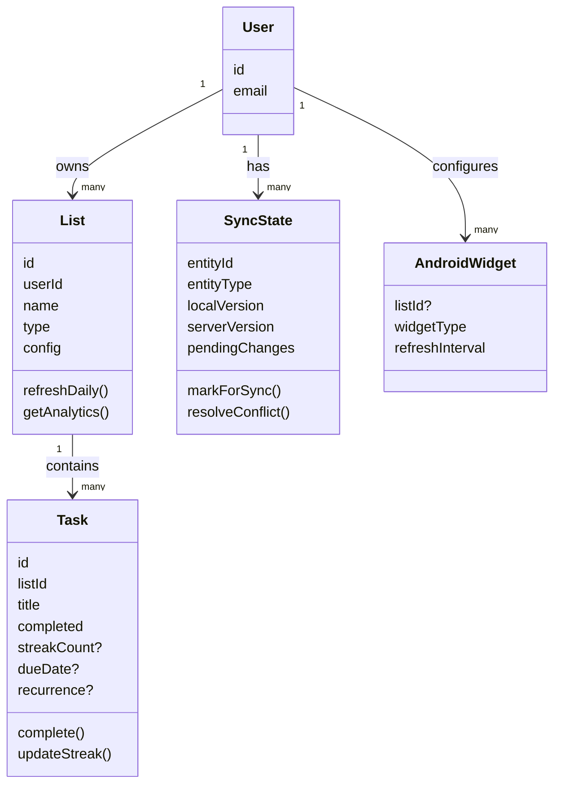
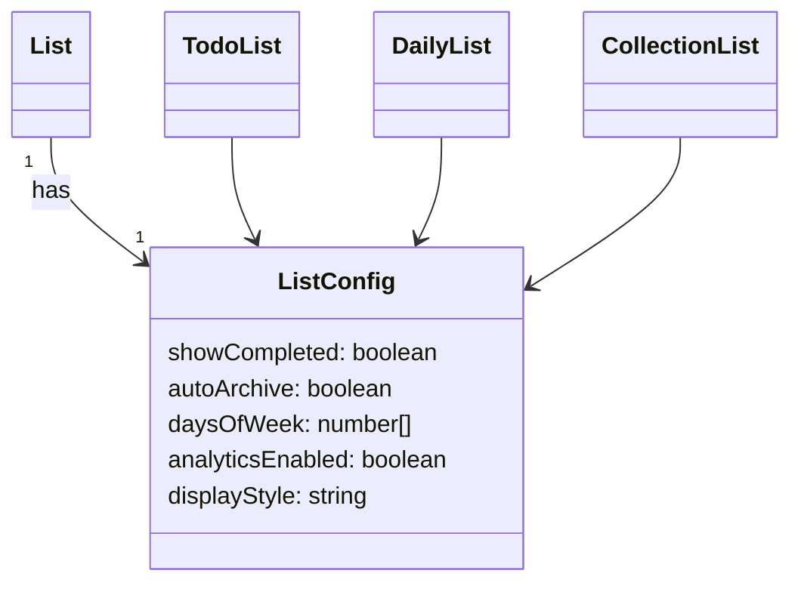
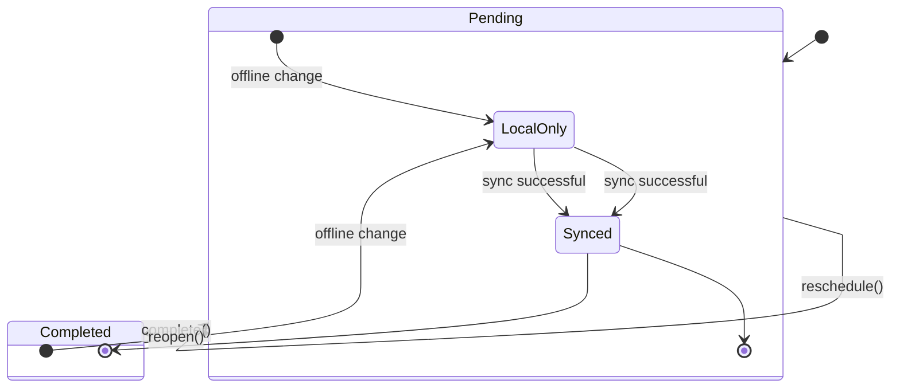
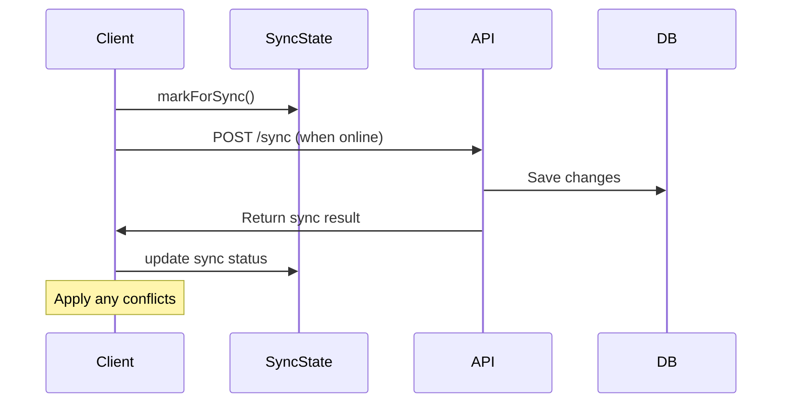

# Domain Model

## User
Represents a person using the system.

Responsibilities:
- Owns lists
- Owns tasks indirectly
- Manages sync across devices

Attributes:
- id
- email

---

## List
A logical container owned by a user.

Depending on its type, a list may contain tasks or other lists.

Types:
- todo: contains regular tasks (once checked, done)
- daily: derives tasks for the current day, refreshes daily for routines/habits
- collection: groups other lists for categorization

Rules:
- A list belongs to one user
- A todo or daily list contains tasks
- A collection list contains other lists
- A list may belong to at most one collection
- Daily lists can be configured by days of the week (e.g., exclude weekends)

Attributes:
- id
- userId
- name
- type
- config (JSON): Configuration settings per list type
  - For daily lists: daysOfWeek, showCompleted, analyticsEnabled
  - For todo lists: showCompleted, autoArchive
  - For collection lists: displayStyle

Behavior:
- daily.refresh(): Generates today's tasks based on recurrence patterns and day-of-week configuration
- daily.getAnalytics(): Returns completion streaks and frequency statistics

---

## Task
A unit of work.

Rules:
- A task belongs to exactly one list
- A task can be completed or pending
- A task may have a due date
- A task may recur (for daily lists)
- Completed tasks can be shown or hidden based on list configuration

Attributes:
- id
- listId
- title
- completed
- order
- dueDate?
- recurrence? (e.g., daily, weekly, custom)
- completedAt? (timestamp for analytics)
- streakCount? (for daily tasks)

Behavior:
- complete()
- reopen()
- reschedule()
- updateStreak(): Updates streak count for daily tasks

---

## SyncState (NEW)
Tracks synchronization status for offline-first operation.

Responsibilities:
- Manages local changes pending sync
- Handles conflict resolution
- Tracks last sync timestamp

Attributes:
- entityId (references User/List/Task)
- entityType
- localVersion
- serverVersion
- pendingChanges (JSON)
- lastSyncedAt
- syncStatus (pending, synced, conflicted)

Behavior:
- markForSync()
- resolveConflict()
- applyRemoteChanges()

---

## AndroidWidget (NEW)
Represents Android home screen widget configuration.

Attributes:
- id
- userId
- listId (optional: specific list to display)
- widgetType (daily, todo, collection)
- refreshInterval
- lastUpdated

---

## Diagrams

### Core Domain Relationships

### List Configuration

### Task Lifecycle with Sync

### Sync Flow

## Future Concepts

### FocusSession
Represents a period of focused work.

Notes:
- Will not be linked to a task
- Used for Pomodoro and analytics
- Can be associated with white noise

### PomodoroCycle
A structured set of focus sessions and breaks.

Notes:
- Built on top of FocusSession
- Configurable work/break intervals
- Can trigger white noise automatically

### WhiteNoise
Focus-inducing sounds for Pomodoro/Focus Sessions.

Attributes:
- id
- name
- audioUrl
- duration
- volumeProfile

Behavior:
- start()
- pause()
- stop()
- fadeOut()

### Analytics (Enhanced)
Daily task completion analytics.

Attributes:
- userId
- date
- completedTasks
- streakCount
- completionRate
- bestStreak

Behavior:
- calculateStreak()
- generateReport()
- plotCompletionGraph()