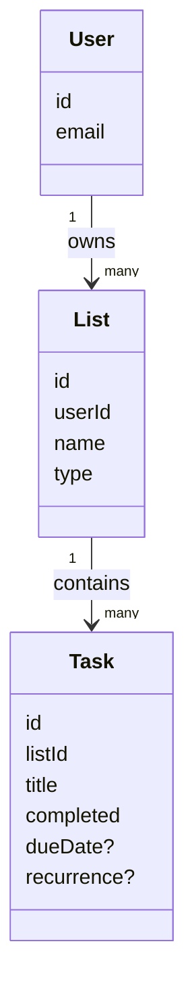
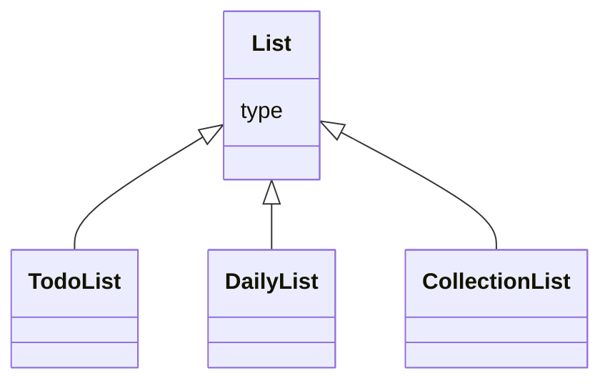
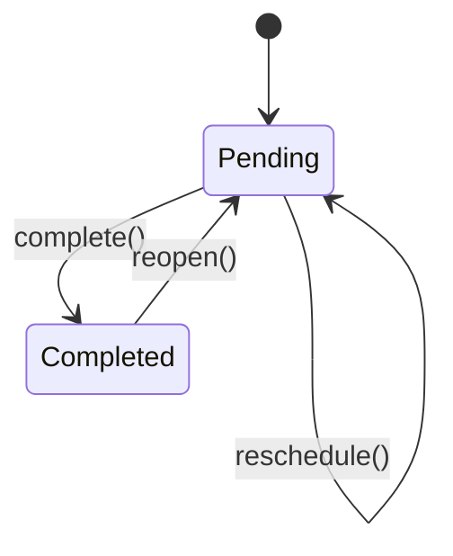
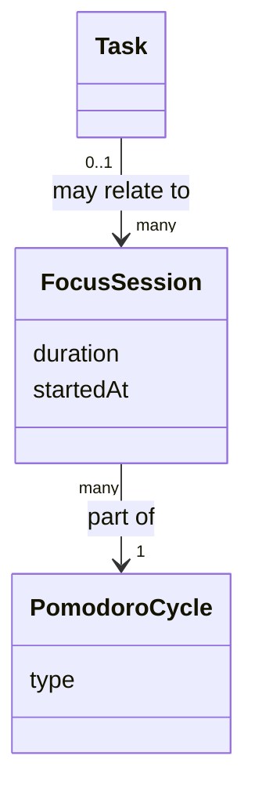
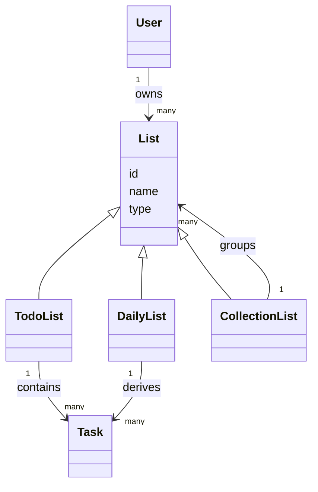

# Domain Model

## User
Represents a person using the system.

Responsibilities:
- Owns lists
- Owns tasks indirectly

Attributes:
- id
- email

---

## List
A logical container owned by a user.

Depending on its type, a list may contain tasks or other lists.

Types:
- todo: contains tasks
- daily: derives tasks for the current day
- collection: groups other lists

Rules:
- A list belongs to one user
- A todo or daily list contains tasks
- A collection list contains other lists
- A list may belong to at most one collection

Attributes:
- id
- userId
- name
- type

---

## Task
A unit of work.

Rules:
- A task belongs to exactly one list
- A task can be completed or pending
- A task may have a due date
- A task may recur

Attributes:
- id
- listId
- title
- completed
- order
- dueDate?
- recurrence?

Behavior:
- complete()
- reopen()
- reschedule()

---

## Future Concepts

### FocusSession
Represents a period of focused work.

Notes:
- May be linked to a task
- Used for Pomodoro and analytics

### PomodoroCycle
A structured set of focus sessions and breaks.

Notes:
- Built on top of FocusSession
- Not required for basic task usage

# Diagrams

## Core Domain Relationships

## List Types

## Task Lifecycle

## Future Domain Extensions

### List Diagram

